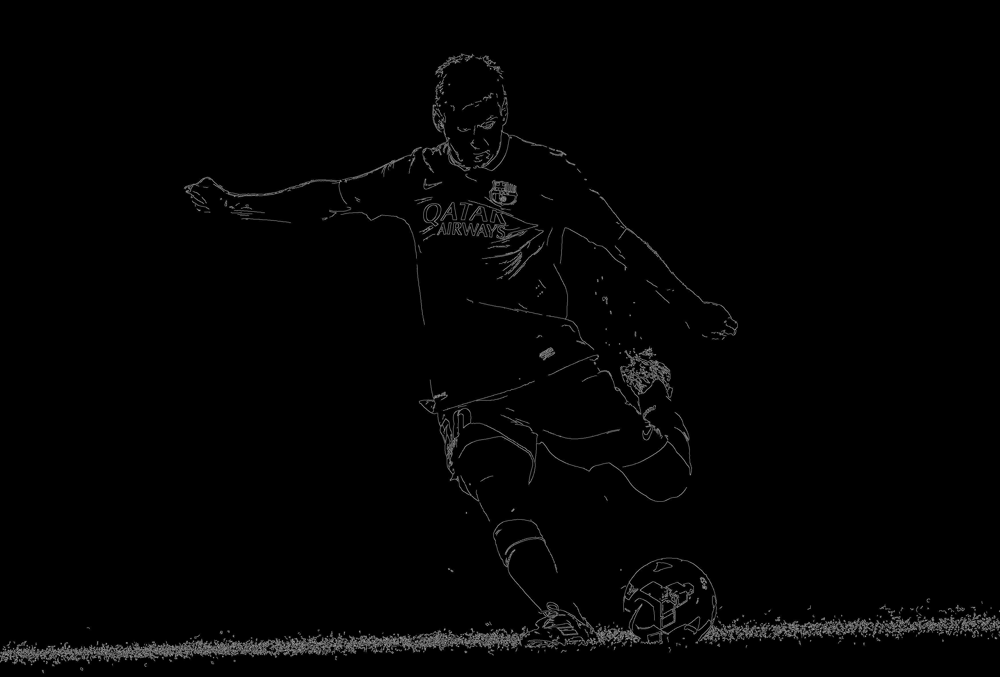

# Advanced Image Manipulations

In this section we will learn various image manipulation and processing techniques that form a set of tools for carrying out computer vision tasks.

## Edge Detection

This is an image processing technique for finding object boundaries in images. It words by detecting discontinuities in brightness. The common edge detection algorithms include Sobel and Canny. OpenCV provides `cv2.Canny()` function for edge detection. To apply this function, we need two parameters - threshold1 and threshold2, or minVal and maxVal respectively. Any edges with intensity gradient more than maxVal are sure to be edges and those below minVal are sure to be non-edges, so discarded. Those who lie between these two thresholds are classified edges or non-edges based on their connectivity. If they are connected to "sure-edge" pixels, they are considered to be part of edges. Otherwise, they are also discarded. See the image below:

<!--  -->

<p align="center">
    
    <!-- <p align="center">insert caption here</p> -->
</p>


```python
import cv2

# read image, we add the 0 to read the image in grayscale
# the expected input to the canny function is a grayscale image
gray_image = cv2.imread("messi.jpg", flags=0)

edges = cv2.Canny(gray_image, threshold1=100, threshold2=200)

```

|      Original Image       |              Canny Edges              |
| :-----------------------: | :-----------------------------------: |
|  |  |


## Image blurring

The blur, or smoothing, of an image removes "outlier" pixels that may be noise in the image. This is a common operation we need to perform before other tasks such as edge detection. There are several blurring functions in OpenCV, such as ['normal' blur](https://docs.opencv.org/2.4/doc/tutorials/imgproc/gausian_median_blur_bilateral_filter/gausian_median_blur_bilateral_filter.html#normalized-box-filter) - `cv2.blur`, [Gaussian blur](https://docs.opencv.org/2.4/doc/tutorials/imgproc/gausian_median_blur_bilateral_filter/gausian_median_blur_bilateral_filter.html#gaussian-filter) - `cv2.GaussianBlur` and the [Median blur](https://docs.opencv.org/2.4/doc/tutorials/imgproc/gausian_median_blur_bilateral_filter/gausian_median_blur_bilateral_filter.html#median-filter) - `cv2.medianBlur`. To apply the blurring, we need to specify the size of the `filter`. Here we use `17 x 17` for a square filter.

```python
blurred_image = cv2.blur(image, (17,17))
```

|      Original Image       |          Blurred Image (17x17)          |
| :-----------------------: | :-------------------------------------: |
|  |  |

## Image Thresholding

This is the simplest method of segmenting images. This method can be used to create binary images such the one shown below. The simplest thresholding methods replace each pixel in an image with a black pixel if the image intensity I is less than some fixed constant, or a white pixel if the image intensity is greater than that constant. In the example image on the below, this results in the dark tree becoming completely black, and the white snow becoming completely white.

|                                            Original Image                                            |                                                  thresholded image                                                   |
| :--------------------------------------------------------------------------------------------------: | :------------------------------------------------------------------------------------------------------------------: |
|  |  |

We will demonstrate thresholding be applying it to a gradient image. OpenCV has various thresholding types such as `cv2.THRESH_BINARY` – most common, `cv2.THRESH_BINARY_INV`, `cv2.THRESH_TRUNC`, `cv2.THRESH_TOZERO`, `cv2.THRESH_TOZERO_INV`. Here we will use `cv2.THRESH_BINARY` to create a binary image.

```python
import cv2

gradient_image = cv2.imread("gradient_image.png", 0) # we load in grayscale

# we want value below 127 go to 0 (black), and above 127 goes to 255(white)
_,thresh1=cv2.threshold(image,127,255,cv2.THRESH_BINARY)

```
## Perspective Transform

With this method, we can change the perspective or `view` of a given image for getting better insights about the required information. This method involves taking important points in a source image and then matching or warping those points to known points in the target image. An example is shown below, where we have a sheet of paper that is not aligned and we use perspective transformation to align the sheet of paper so that the information on it can be easily viewed.


<p align="center">
    
    <!-- <p align="center">insert caption here</p> -->
</p>


```python
import cv2
import numpy as np
import matplotlib.pyplot as plt
image=cv2.imread('paper.jpg')
cv2.imshow('original',image)
cv2.waitKey(0)

#coordinate of 4 corners of original image

points_A=np.float32([[320,15],[700,215],[85,610],[530,780]])

#coordinates of 4 corners of desired output
#we use a ratio of an A4 paper 1:1.41

points_B=np.float32([[0,0],[420,0],[0,592],[420,592]])

#use the two sets of two points to compute the prespective transformation matrix,M
M=cv2.getPerspectiveTransform(points_A,points_B)

# now 'warp' the original image with the transformation matrix to get an aligned image
warped=cv2.warpPerspective(image,M,(420,594))
cv2.imshow('warpprespective',warped)
cv2.waitKey(0)
cv2.destroyAllWindows()

```

Another method of transformation is [Affine Transformation](https://docs.opencv.org/3.4/d4/d61/tutorial_warp_affine.html) (`cv2.warpAffine`). You can read more about this in the provided link.

## Bibliography

1. MathWorks, Edge Detection - https://www.mathworks.com/discovery/edge-detection.html
2. OpenCV, Canny Edge Detection - https://docs.opencv.org/trunk/da/d22/tutorial_py_canny.html
3. Datacarpentry, Blurring images - https://datacarpentry.org/image-processing/06-blurring/
4. Computer Vision: Algorithms and Applications, 1st ed. © 2010 Richard Szeliski, Microsoft Research
5. Image Thresholding - https://en.wikipedia.org/wiki/Thresholding_(image_processing)
6. Image Manipulations in Python OpenCV - https://circuitdigest.com/tutorial/image-manipulation-in-python-opencv-part2
