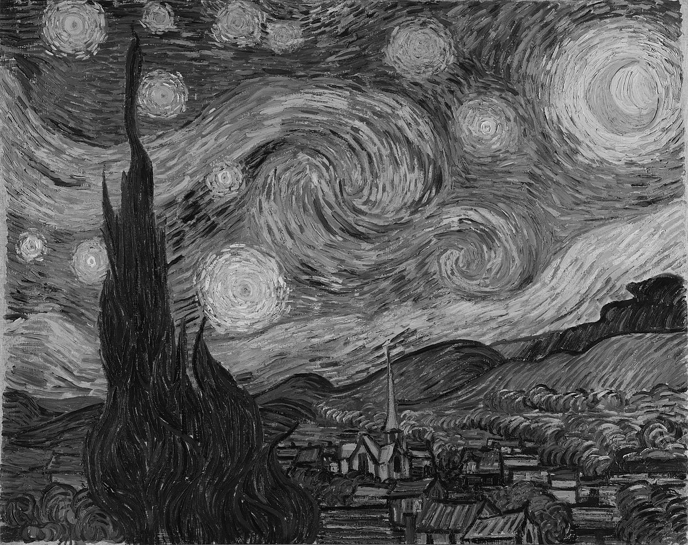

# Introduction to OpenCV

OpenCV (Open Source Computer Vision Library) is an [open-source](https://en.wikipedia.org/wiki/Open_source) library that includes several hundreds of computer vision library. OpenCV was built to provide a common infrastructure for computer vision applications and to accelerate the use of machine perception in the commercial products. Since OpenCV is a collection of libraries for computer vision, it is necessary that we understand some computer vision concepts. However, we will only be concerned about concepts that are used in this class. Please feel free to read about other concepts or theories that interest you.

> Note: If any subject is not clear or you need a deeper explanation of a concept. Please do not hesitate to request for the topic so that it can be added to instruction material.

## What is Computer Vision?

Computer vision is a field of science that deals with how computers can gain high-level understanding from digital images or videos. This field aims to understand and automate the tasks that the human visual system can do. Computer vision tasks includes but are not limited to the following;

1. Image processing
2. Scene reconstruction
3. Object recognition
4. Object tracking
5. 3D pose estimation
6. Learning
7. Indexing
8. Motion estimation
9. 3D scene modeling
10. Augmented Reality

The field of computer vision is very broad, furthermore the scope of this class is not to discuss the field but to apply the tools from the field to specific problems. Therefore, we will not focus on understanding the theory of any methods we use but gain enough understanding to utilize the method. In case of further reading, see the Bibliography section.

### Installing OpenCV as a package

At this stage you should have [installed Python](https://youtu.be/MZsdGUsPzuE) through  [VSCode](https://code.visualstudio.com/) and [Anaconda](https://www.anaconda.com/). Follow the steps below to install OpenCV.

1. Open the terminal or command line in VSCode.
   - You can use `ctrl + shift + @` for this, or click the `View` menu, then, `Terminal`.
2. Install OpenCV package
   - Type `pip install opencv-python`. This installs the package so that you can use it in your python program.

> [Pip](https://pypi.org/project/pip/) is the *de facto* package installer for Python. Like `Anaconda` you can also use pip to install packages written in python.

## Basic Operations in OpenCV

In this section we will introduce basic operations in OpenCV, such as reading and writing images, reading and writing videos, and image types conversion.

### Working with Images

Let us read and display an image. Explanations are included in the code comments.

```python
# import needed libraries
import cv2  # this is how you import opencv
import sys

# read the image, using cv2.imread
path_to_image = "starry_night.jpg"
img = cv2.imread(cv2.samples.findFile(path_to_image))

# in case we cannot read the image
if img is None:
    sys.exit("Could not read the image.")

# if image is read successfully, display the image
cv2.imshow("Display window", img)

# pause the image display until the user presses a key
k = cv2.waitKey(0)

# if the user presses the 's' key, save the image, using cv2.imwrite
if k == ord("s"):
    image_save_path = "starry_night_saved.png"
    cv2.imwrite(image_save_path, img)
```

We can save the image in [grayscale](https://whatis.techtarget.com/definition/grayscale) by adding the following lines of code.

> **Grayscale** is a range of shades of gray without apparent color. The darkest possible shade is black, which is the total absence of transmitted or reflected light. The lightest possible shade is white, the total transmission or reflection of light at all visible wavelengths.

```python
if k == ord("s"):
    image_save_path = "starry_night_saved.png"
    # we convert the image to another color format 
    # by using the `cv2.cvtColor` function
    # We choose the grayscale format by using the `cv2.COLOR_BGR2GRAY` object.
    # other color formats is also possible
    # but let us stick with RGB and Grayscale for now
    image_gray = cv2.cvtColor(img, cv2.COLOR_BGR2GRAY)
    cv2.imwrite(image_save_path, image_gray)
```

Now if you open the saved image in your directory, it should be a grayscale image. The RGB (Red, Green, Blue) color space is perhaps the most well known color space in computer vision. It seem to be more natural to humans and easy to understand. There are many other color spaces but for most applications, RGB is sufficient.

> **RGB color space** or RGB color system, constructs all the colors from the combination of the Red, Green and Blue colors. As a result, it is referred to has having 3 channels. Conversely, a grayscale image has only 1 channel.

|           Color Image            |            Grayscale Image             |
| :------------------------------: | :------------------------------------: |
|  |  |

<!-- page break -->
<!-- <div style="page-break-after: always;"></div> -->

### Working with Videos

In this section, we will learn how to read, display and write videos in OpenCV. We can read video either by the feed from a camera connected to a computer or by reading a video file.

```python
# import opencv
import cv2

# Create a VideoCapture object
# Pass the path to the video file, or
# Pass the number signifying the camera into the function.
# 0 is the first camera, or only camera.
cap = cv2.VideoCapture(0)

# Check if camera opened successfully
if cap.isOpened() == False:
    print("Error opening video stream or file")

# Read until video is completed
while cap.isOpened():
    # Capture frame-by-frame
    ret, frame = cap.read()

    # if a frame is read successfully
    if ret == True:
        # Display the resulting frame
        cv2.imshow("Frame", frame)

        # Press Q on keyboard to exit
        frames_delay = 25 # this is essentially the duration of delay between each frame display
        if cv2.waitKey(frame_delay) & 0xFF == ord("q"):
            break

    # Break the loop
    else:
        break

# the following lines are needed to quit the program successfully
# 1. When everything done, release the video capture object
cap.release()
#2. Closes all the frames
cv2.destroyAllWindows()
```

In order to capture the video and save into a video file, we will add the following

```python
...

# Default resolutions of the frame are obtained.
# The default resolutions are system dependent.
# We convert the resolutions from float to integer.
# obtain width (3) and height (4) properties of cap.
frame_width = int(cap.get(3))
frame_height = int(cap.get(4))

# Define the codec and create VideoWriter object.
# The output is stored in 'outpy.avi' file.
# Define the fps to be equal to 30. Also frame size is passed.
# the writing speed is faster than the cap reading speed so we divide by 2
fps = 30//2
out = cv2.VideoWriter(
    "output.avi",
    cv2.VideoWriter_fourcc("M", "J", "P", "G"),
    fps,
    (frame_width, frame_height),
)

...
# Write the frame into the file 'output.avi'
out.write(frame)

...
# realease the videoWriter object
out.release()
```

Altogether, we have

```python
# import opencv
import cv2

# Create a VideoCapture object
# Pass the path to the video file, or
# Pass the number signifying the camera into the function.
# 0 is the first camera, or only camera.
cap = cv2.VideoCapture(0)

# Check if camera opened successfully
if cap.isOpened() == False:
    print("Error opening video stream or file")


# Default resolutions of the frame are obtained.
# The default resolutions are system dependent.
# We convert the resolutions from float to integer.
# obtain width (3) and height (4) properties of cap.
frame_width = int(cap.get(3))
frame_height = int(cap.get(4))

# Define the codec and create VideoWriter object.
# The output is stored in 'outpy.avi' file.
# Define the fps to be equal to 30. Also frame size is passed.
# the writing speed is faster than the cap reading speed so we divide by 2
fps = 30//2
out = cv2.VideoWriter(
    "output.avi",
    cv2.VideoWriter_fourcc("M", "J", "P", "G"),
    fps,
    (frame_width, frame_height),
)

# Read until video is completed
while cap.isOpened():
    # Capture frame-by-frame
    ret, frame = cap.read()

    # if a frame is read successfully
    if ret == True:
        # Write the frame into the file 'output.avi'
        out.write(frame)
        # Display the resulting frame
        cv2.imshow("Frame", frame)

        # Press Q on keyboard to exit
        frames_delay = 1  # this is essentially the duration of delay between each frame display
        if cv2.waitKey(frames_delay) & 0xFF == ord("q"):
            break

    # Break the loop
    else:
        break

# the following lines are needed to quit the program successfully
# 1. When everything done, release the video capture object
cap.release()
# realease the videoWriter object
out.release()
# 2. Closes all the frames
cv2.destroyAllWindows()

```

Here is the end of introduction to OpenCV. Try the following exercises to test your understanding of what you just learned

## Exercise

1. Read an input image and save the image in the following colour spaces.
   - HSV colour space - cv2.COLOR_RGB2HSV
   - YCrCb colour space - COLOR_BGR2YCrCb
   - Lab colour space - COLOR_BGR2Lab
2. Record a 10 second video of yourself waving your hand, in grayscale.

## Bibiliography

1. OpenCV Documentation - https://docs.opencv.org/4.3.0/d1/dfb/intro.html
2. [Dana H. Ballard; Christopher M. Brown (1982). Computer Vision. Prentice Hall. ISBN 978-0-13-165316-0.](https://www.e-booksdirectory.com/details.php?ebook=1124)
3. Grayscale - https://whatis.techtarget.com/definition/grayscale
4. RGB - https://www.rapidtables.com/web/color/RGB_Color.html