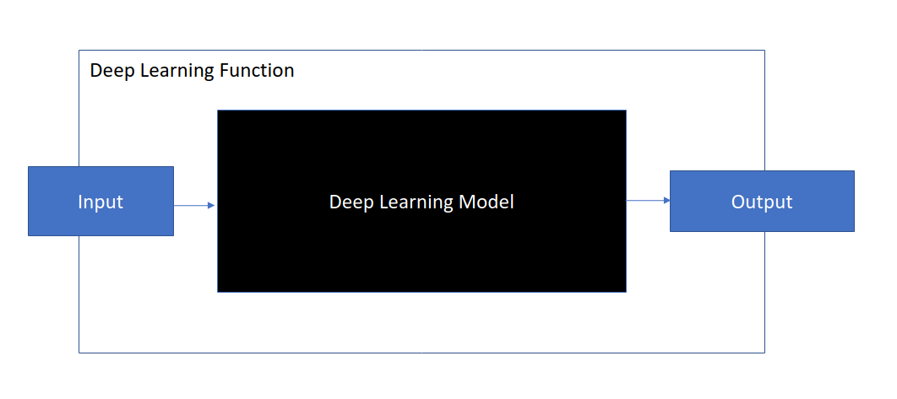

# OCR with OpenCV

Optical Character Recognition (OCR) is the electronic or mechanical conversion of images of typed, handwritten or printed text into machine-encoded text, whether from a scanned document, a photo of a document, a scene-photo or from subtitle text superimposed on an image.

In this section, we will try to understand the problem and learn the process of solving the problem using the tools we have learnt so far. Our object is to recognize characters in a printed document using a webcam.

To solve the OCR problem, we have to do the following

1. Capture Image, from file.
2. Recognize/Selecting paper corners
3. Preprocess Image; Smoothing, Cropping, Perspective Transform.
4. Recognize Text Regions: Thresholding and Contour extraction
5. Recognize individual characters in the text regions
6. Output the recognized text in a readable order.

Due to the length of the code used for this purpose. The code will be supplied in a different file. In order to finish the OCR task, we need two special functions. These functions were developed through a method called [Deep Learning](https://en.wikipedia.org/wiki/Deep_learning), which has become very popular recently for computer vision tasks. Because of its complexity, we will not learn about deep learning in this class. However, it is sufficient to know how to use this class of functions in OpenCV. The two function are;

1. **[The EAST text detector](https://arxiv.org/abs/1704.03155):** This function detects regions in the image where there are texts and it outputs bounding boxes of those text regions.

## Install Tesseract

Tesseract, a highly popular OCR engine, was originally developed by Hewlett Packard in the 1980s and was then open-sourced in 2005. Think of it as a special function that allows us to do OCR, however, to use it we need to install it in a special way.

### Windows Installation

- The Windows installation follows the steps on [this page](https://github.com/tesseract-ocr/tesseract/wiki#windows).

- Install `pytessaract` pip package. This is the interface between python and the tesseract engine.

```bash
pip install pytessearact
```

### Linux Installation

The Linux installation follows the steps on [this page](https://github.com/tesseract-ocr/tesseract/wiki#linux). It should be pretty straight forward.

## Other Python packages

Install `imutils` package to enable us use a `non_max_suppression` function.

```bash
pip install imutils
```

## Download trained models

- EAST text detector model
- Tesseract model

## Using Deep Learning Functions in OpenCV

Using deep learning functions in OpenCV is pretty easy. There are a few things you need to know.

- The input to the function or model
- The output of the model

An illustration is given below. We will treat this function as a black box which we do not know what is inside. However, we need to know how to feed in an input and use the output.



## Text Detection with EAST detector

The first stage of OCR is text detection. As mentioned in the previous section, we are going to use a `pretrained` deep learning model called EAST (An Efficient and Accurate Scene Text Detector) Detector. All we have to do at the stage is to [download the pretrained model](https://drive.google.com/open?id=1yHEuc6AK0JI0yzR4Qcru0Z_6GVGHkwHV) that will be loaded by OpenCV to perform text region detection.
We then used the `dnn` module in OpenCV to load and use the model like so;

```python
# specify the path to the model
model_path = "frozen_east_text_detection.pb"

#load the model
net = cv2.dnn.readNet(model)

# construct a blob from the image and then perform a forward pass of
# the model to obtain the two output layer sets
blob = cv2.dnn.blobFromImage(
    image, 1.0, (W, H), (123.68, 116.78, 103.94), swapRB=True, crop=False
)
net.setInput(blob)
# we now get output from the model.
# In this case, the output is a tuple of scores and geometry
# This will be different for another model
scores, geometry = net.forward(layerNames)
```


## Assignment

- Edit the code so that you can capture image from your webcam in real time.
- Currently the paper size is hard-coded into the program so we have to choose a full paper area for the code to work effectively. Add the feature to be able to select an arbitrary rectangle on the source image and recognize the text in the selected rectangle. **This is not a trivial task**, but if you can do this, then you have understood the OCR problem well enough.

## Bibliography

1. Pyimagesearch, OCR - https://www.pyimagesearch.com/category/optical-character-recognition-ocr/