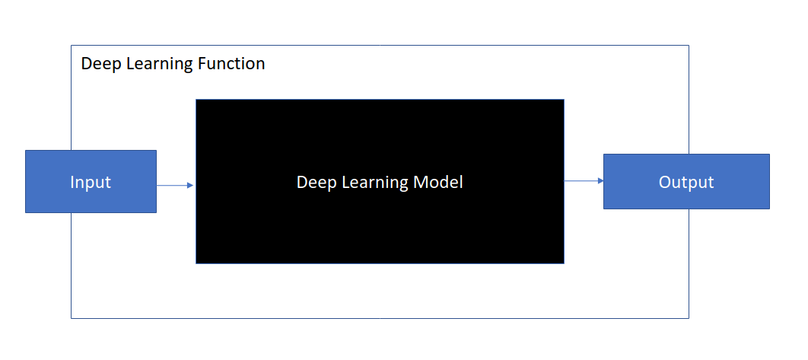

# OCR with OpenCV

Optical Character Recognition (OCR) is the electronic or mechanical conversion of images of typed, handwritten or printed text into machine-encoded text, whether from a scanned document, a photo of a document, a scene-photo or from subtitle text superimposed on an image.

In this section, we will try to understand the problem and learn the process of solving the problem using the tools we have learnt so far. Our object is to recognize characters in a printed document using a webcam.

To solve the OCR problem, we have to do the following

1. Capture Image, from file.
2. Recognize/Selecting paper corners
3. Preprocess Image; Smoothing, Cropping, Perspective Transform.
4. Recognize Text Regions: Thresholding and Contour extraction
5. Recognize individual characters in the text regions
6. Output the recognized text in a readable order.

Due to the length of the code used for this purpose. The code will be supplied in a different file. In order to finish the OCR task, we need two special functions. These functions were developed through a method called [Deep Learning](https://en.wikipedia.org/wiki/Deep_learning), which has become very popular recently for computer vision tasks. Because of its complexity, we will not learn about deep learning in this class. However, it is sufficient to know how to use this class of functions in OpenCV. The two function are;

## [The EAST detector](https://arxiv.org/abs/1704.03155)

The Efficient and Accurate Scene Text Detector (EAST Detector), detects regions in the image where there are texts and outputs bounding boxes (coordinates of the corners of the rectangle surrounding the text) of those text regions.

No need to install EAST separately as it can be accessed through the OpenCV function already installed, we just need to download the [pretrained model](https://drive.google.com/open?id=1yHEuc6AK0JI0yzR4Qcru0Z_6GVGHkwHV) that will be used by OpenCV.


## [Tesseract](https://github.com/tesseract-ocr/tesseract)

a highly popular OCR engine, was originally developed by Hewlett Packard in the 1980s and was then open-sourced in 2005. This function transforms image regions with text into string. That is, it recognizes the string in the image and outputs an editable string literal.
Think of it as a special function that allows us to do OCR, however, to use it we need to install it in a special way.

### Windows Installation

- The Windows installation follows the steps on [this page](https://github.com/tesseract-ocr/tesseract/wiki#windows).

- Install `pytessaract` pip package. This is the interface between python and the tesseract engine.

```bash
pip install pytesseract
```

### Linux Installation

The Linux installation follows the steps on [this page](https://github.com/tesseract-ocr/tesseract/wiki#linux). It should be pretty straight forward.

## Other Python packages

Install `imutils` package to enable us use a [`non_max_suppression`](https://www.pyimagesearch.com/2014/11/17/non-maximum-suppression-object-detection-python/) function.

> Non-maximum-suppression is a way of combining multiple outputs of the same input into one output. So if we have multiple bounding boxes for the same text, we would like to combine these outputs to a single one.

Install as follows;

```bash
pip install imutils
```

## Using Deep Learning Functions in OpenCV

Using deep learning functions in OpenCV is pretty easy. There are a few things we need to know.

- The input to the function or model. We need to know the size and shape of the input that is expected by the model. Most models expect an image with a specific size and number of channels.
- The output of the model. Depending on the application of the model, the output type or shape is different. It is necessary to know this so we can know how to use the model output.

An illustration is given below. We will treat this function as a black box which we do not know what is inside. However, the input and output.



## Text Detection with EAST detector

The first stage of OCR is text detection. As mentioned in the previous section, we are going to use a `pretrained` deep learning model called EAST (An Efficient and Accurate Scene Text Detector) Detector. All we have to do at the stage is to [download the pretrained model](https://drive.google.com/open?id=1yHEuc6AK0JI0yzR4Qcru0Z_6GVGHkwHV) that will be loaded by OpenCV to perform text region detection.
We then used the `dnn` module in OpenCV to load and use the model like so;

```python
# specify the path to the model
model_path = "frozen_east_text_detection.pb"

#load the model
net = cv2.dnn.readNet(model)

# construct a blob from the image and then perform a forward pass of
# the model to obtain the two output layer sets
blob = cv2.dnn.blobFromImage(
    image, 1.0, (W, H), (123.68, 116.78, 103.94), swapRB=True, crop=False
)
net.setInput(blob)
# we now get output from the model.
# In this case, the output is a tuple of scores and geometry
# This will be different for another model
scores, geometry = net.forward(layerNames)
```

In the full script below, We;

- Load an image from path
- Resize the input image to the expected size by the model
- Specify how to use the pretrained model
- Load the pretrained model
- Get the output of the model `(scores, geometry)`
- From the output, draw the text regions on the input image
- Display the result.


```python
# USAGE
# python opencv_text_detection_image.py --image images/lazy_sheet.jpg
# --east frozen_east_text_detection.pb

# import the necessary packages
from imutils.object_detection import non_max_suppression
import numpy as np
import argparse
import time
import cv2


def east_detector(
    image,
    model="frozen_east_text_detection.pb",
    width=640,
    height=640,
    min_confidence=0.5,
):
    """Function that uses the east detector model for text detection.
    The code here is taken from the tutorial: https://www.pyimagesearch.com/2018/08/20/opencv-text-detection-east-text-detector/

    Arguments:
        image {numpy array} -- input image
        model {model weight} -- frozen east model weights
        width {int} -- resized image width (should ge multiple of 32)
        height {int} -- resized image height (should be multiple of 32)

    Returns:
        [numpy array] -- [text bounding boxes]
    """

    (H, W) = image.shape[:2]
    # set the new width and height and then determine the ratio in change
    # for both the width and height
    (newW, newH) = (width, height)
    rW = W / float(newW)
    rH = H / float(newH)

    # resize the image and grab the new image dimensions
    image = cv2.resize(image, (newW, newH))
    (H, W) = image.shape[:2]

    # this part is model specific. Don't worry about the detail
    # Understand that this is how the model is applied.
    # will be different for another model type.
    # define the two output layer names for the EAST detector model that
    # we are interested -- the first is the output probabilities and the
    # second can be used to derive the bounding box coordinates of text
    layerNames = ["feature_fusion/Conv_7/Sigmoid", "feature_fusion/concat_3"]

    # load the pre-trained EAST text detector
    print("[INFO] loading EAST text detector...")
    net = cv2.dnn.readNet(model)

    # construct a blob from the image and then perform a forward pass of
    # the model to obtain the two output layer sets
    blob = cv2.dnn.blobFromImage(
        image, 1.0, (W, H), (123.68, 116.78, 103.94), swapRB=True, crop=False
    )
    start = time.time()
    net.setInput(blob)
    (scores, geometry) = net.forward(layerNames)
    end = time.time()

    # show timing information on text prediction
    print("[INFO] text detection took {:.6f} seconds".format(end - start))

    # grab the number of rows and columns from the scores volume, then
    # initialize our set of bounding box rectangles and corresponding
    # confidence scores
    (numRows, numCols) = scores.shape[2:4]
    rects = []
    confidences = []

    # loop over the number of rows
    for y in range(0, numRows):
        # extract the scores (probabilities), followed by the geometrical
        # data used to derive potential bounding box coordinates that
        # surround text
        scoresData = scores[0, 0, y]
        xData0 = geometry[0, 0, y]
        xData1 = geometry[0, 1, y]
        xData2 = geometry[0, 2, y]
        xData3 = geometry[0, 3, y]
        anglesData = geometry[0, 4, y]

        # loop over the number of columns
        for x in range(0, numCols):
            # if our score does not have sufficient probability, ignore it
            if scoresData[x] < min_confidence:
                continue

            # compute the offset factor as our resulting feature maps will
            # be 4x smaller than the input image
            (offsetX, offsetY) = (x * 4.0, y * 4.0)

            # extract the rotation angle for the prediction and then
            # compute the sin and cosine
            angle = anglesData[x]
            cos = np.cos(angle)
            sin = np.sin(angle)

            # use the geometry volume to derive the width and height of
            # the bounding box
            h = xData0[x] + xData2[x]
            w = xData1[x] + xData3[x]

            # compute both the starting and ending (x, y)-coordinates for
            # the text prediction bounding box
            endX = int(offsetX + (cos * xData1[x]) + (sin * xData2[x]))
            endY = int(offsetY - (sin * xData1[x]) + (cos * xData2[x]))
            startX = int(endX - w)
            startY = int(endY - h)

            # add the bounding box coordinates and probability score to
            # our respective lists
            rects.append((startX, startY, endX, endY))
            confidences.append(scoresData[x])

    # apply non-maxima suppression to suppress weak, overlapping bounding
    # boxes
    boxes = non_max_suppression(np.array(rects), probs=confidences)
    return boxes, confidences


if __name__ == "__main__":
    # construct the argument parser and parse the arguments
    ap = argparse.ArgumentParser()
    ap.add_argument("-i", "--image", type=str, help="path to input image")
    ap.add_argument(
        "-east", "--east", type=str, help="path to input EAST text detector"
    )
    ap.add_argument(
        "-c",
        "--min-confidence",
        type=float,
        default=0.5,
        help="minimum probability required to inspect a region",
    )
    ap.add_argument(
        "-w",
        "--width",
        type=int,
        default=640,
        help="resized image width (should be multiple of 32)",
    )
    ap.add_argument(
        "-e",
        "--height",
        type=int,
        default=640,
        help="resized image height (should be multiple of 32)",
    )
    args = vars(ap.parse_args())

    # load the input image and grab the image dimensions
    image = cv2.imread(args["image"])
    orig = image.copy()

    boxes, confidences = east_detector(
        image,
        args["east"],
        args["width"],
        args["height"],
        min_confidence=args["min_confidence"],
    )

    (H, W) = image.shape[:2]
    # set the new width and height and then determine the ratio in change
    # for both the width and height
    (newW, newH) = (args["width"], args["height"])
    rW = W / float(newW)
    rH = H / float(newH)

    print(len(boxes))

    # loop over the bounding boxes
    for (startX, startY, endX, endY) in boxes:
        # scale the bounding box coordinates based on the respective
        # ratios
        startX = int(startX * rW)
        startY = int(startY * rH)
        endX = int(endX * rW)
        endY = int(endY * rH)

        # draw the bounding box on the image
        cv2.rectangle(orig, (startX, startY), (endX, endY), (0, 255, 0), 2)

    # show the output image
    cv2.imshow("Text Detection", orig)
    cv2.waitKey(0)
```

After running the detector, you should have this output;


## Bibliography

1. Pyimagesearch, OCR - https://www.pyimagesearch.com/category/optical-character-recognition-ocr/