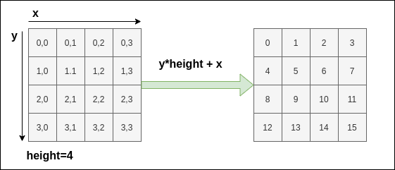

# OCR with OpenCV 2 - Text recognition with pytesseract.

So far, we have seen  text region detection with EAST detector. In this section we will look at individual text recognition with pytesseract. This will enable us to save recognized text to a text file.

## Process Image

First we need to get the total text region corners. We are going to use OpenCV to display the image and record the corners through mouse clicks on the image. This mouse clicks will give us the coordinate of the text region.

In OpenCV, this is achieved through callback event functions.

> A **callback function** is a function passed into another function as an argument, which is then invoked inside the outer function to complete some kind of routine or action.
> Here is a quick example:
>
> ```python
> # the callback function
> def greeting(name):
>    print(f"Hello {name}") # this is another way to add variables in a string
> 
> # the function that calls the callback function
> def process_user_input(callback):
>   # ask a user for name
>   name = input("Please enter your name: ")
>   # then call the callback function when name is supplied
>   callback(name)
> 
> process_user_input(greeting)

Our callback function will store and return 4 mouse click locations. We will also be able to delete a recorded location by a middle-click. If all 4 clicks are not registered, the program is halted. Here is a snippet of how this is done.

```python
import cv2


def get_paper_corners(frame):
    """get corner of papers using mouse callback
    Arguments:
        frame {numpy array} -- input frame or image
    Raises:
        an AssertionError: Selected corner points must be equal to 4.
    Returns:
        [list] -- a list of corner points
    """
    corners = []

    # we declare this function in another function because
    # we do not supply arguments while calling the callback, but
    # we want to store the corner values in `corners`
    def get_click_coord(event, x, y, flags, param):
        """Callback function to get coordinate of clicked points
        Arguments:
            event {cv2.EVENT} -- OpenCV Event
            x {int} -- x coordinate
            y {int} -- y coordinate
            flags {[type]} -- event flag. Not used
            param {[type]} -- event parameter. Not used
        """
        if event == cv2.EVENT_LBUTTONDOWN:
            if len(corners) > 4:
                corners.pop()
            corners.append([x, y])
            print(corners)
        elif event == cv2.EVENT_MBUTTONDOWN:
            if len(corners) > 0:
                corners.pop()
                print(corners)

    # give our window a name
    window_name = "display"
    cv2.namedWindow(window_name)
    cv2.setMouseCallback(window_name, get_click_coord)

    cv2.imshow(window_name, frame)
    cv2.waitKey(0)

    # raise an error if the number of corners supplied is no up to 4
    assert len(corners) > 3, "Corner points are not complete. Must be 4!"
    return corners
```

We can now use the function in our main python file:

```python
# import the function. from process_frame.py
from process_frame import get_paper_corners
...

# get paper corners by calling the function
paper_corners = np.float32(get_paper_corners(input_image))
```

## Recognize Text Regions

We are going to reuse the text region recognition function that we saw in the last section to determine individual regions or words in the image. To do that, we will only need to use our already saved `east_text_detector.py` and then import the `text_detector` function into our main file.

```python

# import text region detector
from east_text_detector import east_detector
...
# use the text detector
boxes, confidences = east_detector(warped_image)

```

## Recognize each words

Here, we will use the tesseract engine to recognize the text in each recognized region. This may take some time depending on the number of words in the image.

```python
# in order to apply Tesseract v4 to OCR text we must supply
# (1) a language, (2) an OEM flag of 4, indicating that the we
# wish to use the LSTM neural net model for OCR, and finally
# (3) an OEM value, in this case, 7 which implies that we are
# treating the ROI as a single line of text
config = "-l eng --oem 1 --psm 7"
text = pytesseract.image_to_string(roi, config=config)
```

## Sort Words

We also have to arrange the words in human readable form close to how it is shown in the image (even though this is a little difficult). The idea of sorting the word here is to treat the words as if they are on only one line but broken into successive lines. Suppose one word occupies a grid as shown in the image below, then we can determine the order of the word by using the address of the grid, and then converting this address to a number representing the order of that word. 



In the code, we use a **lambda function** as the key to sort the results according to our fomular. The results from the text detector is a `tuple of tuple` containing the bounding box of the text. `[0][1]` and `[0][0]` prepresent the coordinate (or address) of the top left corner of the bounding box.

```python
# sort the results bounding box coordinates from top to bottom
# we need a line quantize to reduce the number of horizontal lines
# and group more words on the same line
line_quantize = 40
image_height = 720
results = sorted(
    results, key=lambda r: r[0][1] * image_height // line_quantize + r[0][0]
)
```

> In python, **lambda function** is a single-line function declared with no name, which can have any number of arguments, but it can only have one expression. Such a function is capable of behaving similarly to a regular function declared using the Python's def keyword.


## Save the detections to a text file

We can save a text file like so;

```python
# after getting all the text from the image
# write output to file
output_file = open("scan_text.txt", "a")
output_file.write(all_text)
output_file.close()
```

## Full script

Bringing all of these together, we now have our OCR script as follows:

```python
"""
ocr script
"""

import os

import cv2
import numpy as np
import pytesseract

# user packages
from process_frame import get_paper_corners
from east_text_detector import east_detector

# The next line is needed in windows only,
# so it only runs if the system is windows
if os.name == "nt":
    pytesseract.pytesseract.tesseract_cmd = (
        r"C:\Users\joshu\AppData\Local\Tesseract-OCR\tesseract.exe"
    )

input_image = cv2.imread("lazy_sheet.jpg")  # hard-coded image path
gray_image = cv2.cvtColor(input_image, cv2.COLOR_RGB2GRAY)

# detect paper edges
edge_image = cv2.Canny(gray_image, threshold1=100, threshold2=200)

# run the get paper corners function, and convert to numpy float32 type
paper_corners = np.float32(get_paper_corners(input_image))
print("paper corners: ", paper_corners)

new_corners = np.float32([[0, 0], [540, 0], [0, 720], [540, 720]])
print(input_image.shape)

# get the transformation matrix between the points
transform_matrix = cv2.getPerspectiveTransform(paper_corners, new_corners)
warped_image = cv2.warpPerspective(input_image, transform_matrix, (540, 720))

# detect text bounding boxes
boxes, confidences = east_detector(warped_image)
(H, W) = warped_image.shape[:2]

# set the new width and height and then determine the ratio in change
# for both the width and height
(newW, newH) = (640, 640)
rW = W / float(newW)
rH = H / float(newH)

# padding for bouding boxes
padding = 0.05

results = []
# loop over the bounding boxes
for (startX, startY, endX, endY) in boxes:
    # scale the bounding box coordinates based on the respective
    # ratios
    startX = int(startX * rW)
    startY = int(startY * rH)
    endX = int(endX * rW)
    endY = int(endY * rH)

    # use pytessaract to get text
    # in order to obtain a better OCR of the text we can potentially
    # apply a bit of padding surrounding the bounding box -- here we
    # are computing the deltas in both the x and y directions
    dX = int((endX - startX) * padding)
    dY = int((endY - startY) * padding)
    # apply padding to each side of the bounding box, respectively
    startX = max(0, startX - dX)
    startY = max(0, startY - dY)
    endX = min(540, endX + (dX * 2))
    endY = min(720, endY + (dY * 2))

    # extract the actual padded ROI
    roi = warped_image[startY:endY, startX:endX]

    # in order to apply Tesseract v4 to OCR text we must supply
    # (1) a language, (2) an OEM flag of 4, indicating that the we
    # wish to use the LSTM neural net model for OCR, and finally
    # (3) an OEM value, in this case, 7 which implies that we are
    # treating the ROI as a single line of text
    config = "-l eng --oem 1 --psm 7"
    text = pytesseract.image_to_string(roi, config=config)
    # add the bounding box coordinates and OCR'd text to the list
    # of results
    results.append(((startX, startY, endX, endY), text))

    # draw the bounding box on the image
    # cv2.rectangle(warped_image, (startX, startY), (endX, endY), (0, 255, 0), 2)

# sort the results bounding box coordinates from top to bottom
line_quantize = 40
image_height = 720
results = sorted(
    results, key=lambda r: r[0][1] * image_height // line_quantize + r[0][0]
)

# loop over the results
all_text = ""
for ((startX, startY, endX, endY), text) in results:
    # display the text OCR'd by Tesseract

    # print("OCR TEXT")
    # print("========")
    # print("{}\n".format(text))

    # strip out non-ASCII text so we can draw the text on the image
    # using OpenCV, then draw the text and a bounding box surrounding
    # the text region of the input image
    text = "".join([c if ord(c) < 128 else "" for c in text]).strip()
    all_text += " " + text
    # output = warped_image.copy()
    cv2.rectangle(warped_image, (startX, startY), (endX, endY), (0, 0, 255), 2)
    cv2.putText(
        warped_image,
        text,
        (startX, startY),
        cv2.FONT_HERSHEY_SIMPLEX,
        0.5,
        (255, 0, 0),
        1,
    )

print(all_text)

# write output to file
output_file = open("scan_text.txt", "a")
output_file.write(all_text)
output_file.close()

# show the output image
cv2.imshow("Text Detection", warped_image)
cv2.waitKey(0)

# close all windows
cv2.destroyAllWindows()

```

## Assignment

- Edit the code so that you can capture image from your webcam in real time.
- Currently the paper size is hard-coded into the program so we have to choose a full paper area for the code to work effectively. Add the feature to be able to select an arbitrary rectangle on the source image and recognize the text in the selected rectangle. **This is not a trivial task**, but if you can do this, then you have understood the OCR problem well enough.

## Bibliography

1. Pyimagesearch, OCR - https://www.pyimagesearch.com/category/optical-character-recognition-ocr/
2. MDN Web Docs, Callback Functions - https://developer.mozilla.org/en-US/docs/Glossary/Callback_function
3. Stackabuse, Lambda Functions in Python - https://stackabuse.com/lambda-functions-in-python/