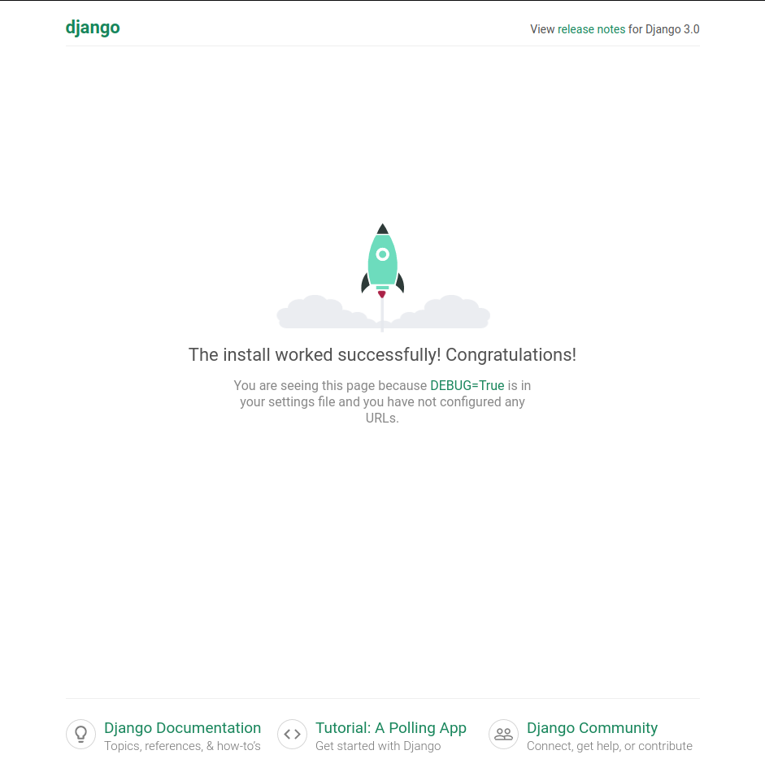

# Introduction to Django Framework

Django is a high-level Python web framework that enables rapid development of secure and maintainable websites. Django helps you write software that is; complete, versatile, secure, scalable, maintainable and portable.

## What does Django code look like

Django web applications typically group the code that handles each of these steps into separate files:


- **URLs:** While it is possible to process requests from every single URL via a single function, it is much more maintainable to write a separate view function to handle each resource. A URL mapper is used to redirect HTTP requests to the appropriate view based on the request URL. The URL mapper can also match particular patterns of strings or digits that appear in a URL and pass these to a view function as data.
- **View:** A view is a request handler function, which receives HTTP requests and returns HTTP responses. Views access the data needed to satisfy requests via models, and delegate the formatting of the response to templates.
- **Models:** Models are Python objects that define the structure of an application's data, and provide mechanisms to manage (add, modify, delete) and query records in the database. 
- **Templates:** A template is a text file defining the structure or layout of a file (such as an HTML page), with placeholders used to represent actual content. A view can dynamically create an HTML page using an HTML template, populating it with data from a model. A template can be used to define the structure of any type of file; it doesn't have to be HTML!

## Setting up Django

Assuming you already have python installed on your system with Anaconda environment. You can easily install django by typing `pip install django`.

> Note that the version of python you should be working with is 3.6 or above. In case you have another version installed, you can install the correct version using `conda install python=3.7`.

### Test your installation

To test the Django installation, we will create a skeleton project and see it working. To do this, first navigate in your command prompt/terminal to where you want to store your Django apps. Create a folder for your test site and navigate into it.

```bash
mkdir django_test
cd django_test
```

Now create a skeleton site called `testsite` using the **`django-admin`** tool as shown. After creating the site you can navigate into the folder where you will find the main script for managing projects, called **`manage.py`**.

```bash
django-admin startproject testsite
cd testsite
```

You can now run the development server from within the folder using **`manage.py`** and the `runserver` command as shown.

```bash
python manage.py runserver 
Performing system checks...

System check identified no issues (0 silenced).

You have 17 unapplied migration(s). Your project may not work properly until you apply the migrations for app(s): admin, auth, contenttypes, sessions.
Run 'python manage.py migrate' to apply them.

April 26, 2020 - 14:15:43
Django version 3.0.3, using settings 'testsite.settings'
Starting development server at http://127.0.0.1:8000/
Quit the server with CONTROL-C.
```
> You can ignore the warnings about "17 unapplied migration(s)" at this point.

Once the server is running you can view the site by navigating to the following URL on your local web browser: http://127.0.0.1:8000/. You should see a site that looks like this:



Congratulations! You have run your first and simplest django web application. In the next section, we will follow the same process but with more involved steps to create a mini blog.

# Bibliography

1. MDN Web Docs, Django Web Framework - https://developer.mozilla.org/en-US/docs/Learn/Server-side/Django