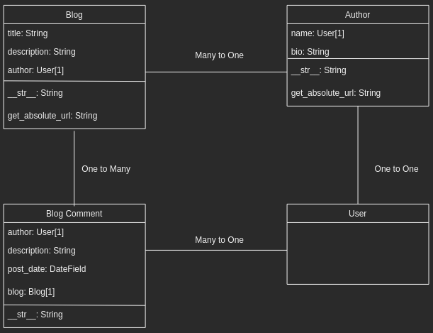
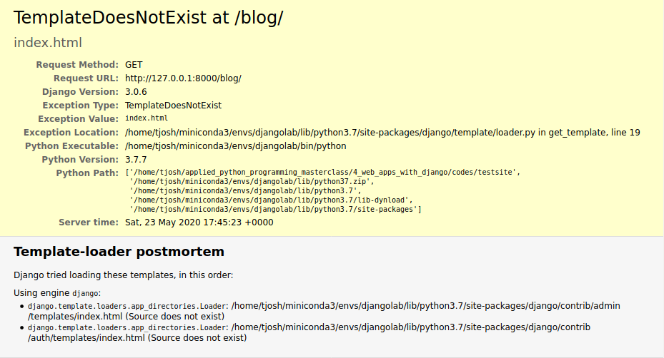
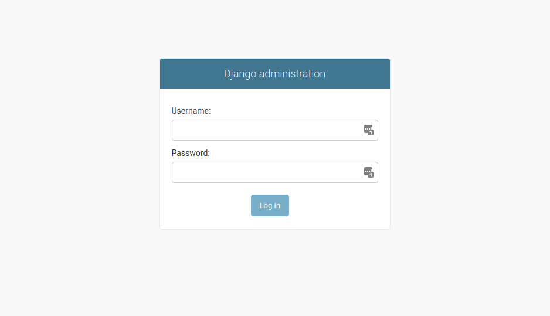
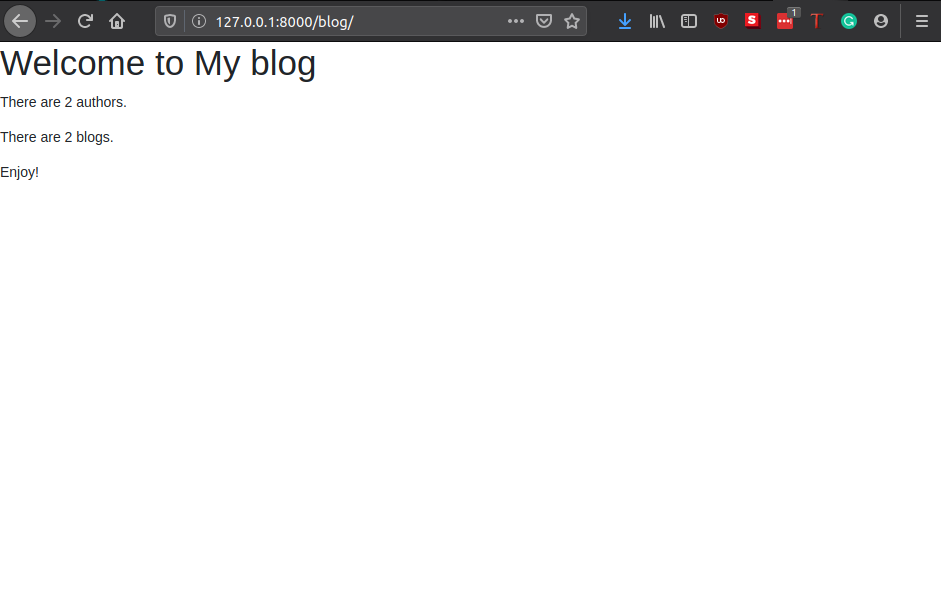

# Django Mini Blog, Part 1

In this section, we are going to create a Mini Blog using the Djanog framework.
Our blog will have 3 main pages namely,

- the Home page,
- All Blogs page,
- All Bloggers page.

Users will also be able to create a profile and sign in to read blog details.

## Create application

In Django, a project is made up of applications. You can think of this as features added to a website. In our case, we will build a website with a blog application. For now, the blog application will be the only feature of the website. However, we can easily add new features by adding new apps. Each app work independently so this makes Django applications modular and portable.

We are going to create a blog app inside our `testsite`. To create an app, run:

```python
python3 manage.py startapp blog
```

Next, we will need to register the app in our project settings, located in `testsite/testsite/settings.py`

```python
INSTALLED_APPS = [
    'django.contrib.admin',
    'django.contrib.auth',
    'django.contrib.contenttypes',
    'django.contrib.sessions',
    'django.contrib.messages',
    'django.contrib.staticfiles',
    'blog',  # register our new app here
]
```

## Specify the database

At this stage, don't worry much about databases. This is typically where the information about our site is stored. So any time a user makes a request, the information is retrieved from the database.

> A [database](https://www.oracle.com/database/what-is-database.html) is an organized collection of structured information, or data, typically stored electronically in a computer system. A database is usually controlled by a database management system (DBMS). Together, the data and the DBMS, along with the applications that are associated with them, are referred to as a database system, often shortened to just database.
> Data within the most common types of databases in operation today is typically modeled in rows and columns in a series of tables to make processing and data querying efficient. The data can then be easily accessed, managed, modified, updated, controlled, and organized. Most databases use structured query language (SQL) for writing and querying data.

We'll use the SQLite database for this example, because we don't expect to require a lot of concurrent access on a demonstration database, and also because it requires no additional work to set up! You can see how this database is configured in settings.py (more information is also included below):

```python
DATABASES = {
    'default': {
        'ENGINE': 'django.db.backends.sqlite3',
        'NAME': os.path.join(BASE_DIR, 'db.sqlite3'),
    }
}
```

Because we are using SQLite, we don't need to do any further setup here. Let's move on!

## Set the url mapper

Hook up the URL mapper, inside the project `url.py` and app `url.py`.
To do this, create `url.py` file in the `blog` directory, then add the following lines in the project `url.py`. Since our website only has the blog app for now, we will make our blog the home page of the website.;

```python
from django.urls import path, include
from django.views.generic import RedirectView

from django.conf import settings
from django.conf.urls.static import static

urlpatterns = [
    path("admin/", admin.site.urls),
    path("blog/", include("blog.urls")), # add blog app's urls

    # plus we want the home path to be redirected to the blog home
    path("", RedirectView.as_view(url="blog/", permanent=True)),
] + static(settings.STATIC_URL, document_root=settings.STATIC_ROOT)
```

This ensures that the URLs in the app are accessible and included into the main project. Right now there is nothing in the app `urls.py` but it is ok.

> [URL](https://developer.mozilla.org/en-US/docs/Learn/Common_questions/What_is_a_URL) stands for Uniform Resource Locator. A URL is nothing more than the address of a given unique resource on the Web. In theory, each valid URL points to a unique resource. Such resources can be an HTML page, a CSS document, an image, etc.

## Create a home page

Now let us finish setting up the URLs in the app. Add the following;

```python
from django.urls import path
from . import views

urlpatterns = [
    path("", views.index, name="index"),
]
```

The urlpatterns is a list of urls that needs to be matched with a requested url when a user requests a page (as you know, each page has a url). Each item urlpatterns is connected to a respective `view` which determines how the requested information is presented to the user.

Before, we go ahead let us talk about the structure that we want for our website. Basically, the pages we want to create and the elements that we want to put on each page.



The image above shows the basic elements or `models` in our website. That is the pages on our website will show information about these elements in various ways. This is what is known as `views`. Note the relationship between one model and another. For example, the relationship between `Blog` and `Author` is `Many-to-One` meaning that an author can write multiple blogs or, technically in our case, a blog post can only have one author. Other models have respective relationships.
So in order to create a page, we need to create a `model` a, corresponding `view` that gets the requested data from the models, and `HTML` pages that display the data, and return the pages to the user to view in the browser. The html files are also called `templates`. That is files that are used when rendering data in the `views`. Remember this image from the previous section, describing Django codes;


> [HTML](https://www.w3schools.com/html/html_intro.asp) is the standard markup language for creating Web pages. It describes the structure of the web page and tells the browser how to display the content.
> This is a simple HTML document;
>
> ```html
><!DOCTYPE html>
> <html>
> <head>
> <title>Page Title</title>
> </head>
> <body>
>
> <h1>My First Heading</h1>
> <p>My first paragraph.</p>
>
> </body>
> </html>
>```
>
> The `<!DOCTYPE html>` declaration defines this document to be HTML5. 
> The `<html>` element is the root element of an HTML page
> The `<head>` element contains meta information about the document
> The `<title>` element specifies a title for the document
> The `<body>` element contains the visible page content
> The `<h1>` element defines a large heading
> The `<p>` element defines a paragraph

***Since this course is focused on Python Programming, we will not go in detail into writing HTMLs. We will treat them as placeholders and give the explanations as necessary.***

Now let's create the `models`, represented as python `classes`.

> Models are Python objects that define the structure of an application's data, and provide mechanisms to manage (add, modify, delete) and query records in the database.

```python
# for date and time data types
from datetime import date

# to manage users on the site
from django.contrib.auth.models import User

from django.urls import (
    reverse,  # used to generate url by reversing the URL patterns
)


class Author(models.Model):
    """Model representing the author of blogs or comments"""

    # think of model submodules as columns of a table 
    # that store different data types

    # The ForeignKey provides a many-to-one relation
    # by adding a column to the local model to hold the remote value.
    # Here we are using it to store user data since each user is unique
    name = models.ForeignKey(User, on_delete=models.CASCADE)

    # The character field is good for short strings
    bio = models.CharField(
        max_length=200, help_text="Write a short bio of the author"
    )

    def get_absolute_url(self):
        """Returns the url to access a particular author instance"""
        return reverse("author-detail", args=[str(self.id)])

    def __str__(self):
        """String for representing the model object"""
        return f"{self.name}"


class Blog(models.Model):
    """Model representing the blog posts or comments"""

    title = models.CharField(max_length=200)
    author = models.ForeignKey(User, on_delete=models.CASCADE)
    description = models.CharField(max_length=1500)

    # for date or time based data types 
    post_date = models.DateField(null=True, blank=True)

    # for longer text data types
    body = models.TextField()

    def get_absolute_url(self):
        """Returns the url to access a blog"""
        return reverse("blog-detail", args=[str(self.id)])

    def __str__(self):
        return f"{self.title}"


class BlogComment(models.Model):
    """Model representing blog comments"""

    author = models.ForeignKey(User, on_delete=models.CASCADE)
    description = models.CharField(max_length=400)
    post_date = models.DateTimeField(auto_now=True)
    blog = models.ForeignKey("Blog", on_delete=models.SET_NULL, null=True)

    def __str__(self):
        return f"{self.description}"

```

To finish adding models, we need to register them, in `testsite/blog/admin.py`.

```python
from .models import Author, Blog, BlogComment

admin.site.register(Author)
admin.site.register(Blog)
admin.site.register(BlogComment)
```

With this down, we now create the `view` for the home page in `views.py`.

```python
from blog.models import Author, Blog, BlogComment

def index(request):
    """View function for home page of site."""

    # For now, Let us just show the number of blogs
    # and number of authors on the home page.
    # This is how you generate counts of some of the main objects
    num_blogs = Blog.objects.all().count()
    num_authors = Author.objects.all().count()

    context = {
        "num_blogs": num_blogs,
        "num_authors": num_authors,
    }

    # Render the HTML template index.html with the data in the context variable
    return render(request, "index.html", context=context)
```

Right now, we have done half of the job, but we need to create some data for the website. To do this we will first apply the changes we made, by running database migration. This updates our database to include any models in our installed applications (and removes some build warnings).

```bash
python manage.py makemigrations
python manage.py migrate
```

The `makemigrations` command creates (but does not apply) the migrations for all applications installed in your project (you can specify the application name as well to just run a migration for a single project). This gives you a chance to checkout the code for these migrations before they are applied — when you're a Django expert you may choose to tweak them slightly!

The `migrate` command actually applies the migrations to your database (Django tracks which ones have been added to the current database).

## Running the website

During development you can test the website by first serving it using the development web server, and then viewing it on your local web browser. Run the development web server by calling the `runserver` command (in the same directory as manage.py):

```bash
python3 manage.py runserver

Performing system checks...

System check identified no issues (0 silenced).
May 23, 2020 - 17:44:57
Django version 3.0.6, using settings 'testsite.settings'
Starting development server at http://127.0.0.1:8000/
Quit the server with CONTROL-C.
```

Once the server is running you can view the site by navigating to http://127.0.0.1:8000/ in your local web browser. You should see a site error page that looks like this:



There are two things we are yet to do. Our website does not have data and we have not defined a `template` for our home page. Let us fix this next.

## Create a superuser

If you navigate to http://127.0.0.1:8000/admin in your browser, you will see an image like the one below:



Even though we cannot see our website, it is evident that everything has been ok so far. Now we need to create a user in order to set up the `backend` of our website.

```bash
python manage.py createsuperuser
```

Follow the prompt to choose a username and password. Once this is done, you can go back to the django admin in the browser and sign in with the user you have just created.

You should see something like this after signing in;


Here, you can see the models that we have created. You can go ahead and check around in each models. Also fill in some dummy data that we can use to verify our website. We already have one `User` which is you, so create and extra one that you can assign a blog. Make sure to have about two blogs and at least on comment for each blog.

## Create the homepage template

Now that we have some data, let us create a template for our home page. Nothing fancy here though. It is good practice to keep things organized in directories so we are going to create a `template` directory where we will store all our `html` files for the app. Now, create an `index.html` in `testsite/blog/templates/` and fill in the following.

```html
<!DOCTYPE html>
<html lang="en">

<head>
    
    <title>Tjosh Blog</title>
    
    <meta charset="utf-8">
    <meta name="viewport" content="width=device-width, initial-scale=1">
    <link rel="stylesheet" href="https://stackpath.bootstrapcdn.com/bootstrap/4.1.3/css/bootstrap.min.css"
        integrity="sha384-MCw98/SFnGE8fJT3GXwEOngsV7Zt27NXFoaoApmYm81iuXoPkFOJwJ8ERdknLPMO" crossorigin="anonymous">
    <!-- Add additional CSS in static file -->
    
    <link rel="stylesheet" href="">
</head>

<body>
    <h1>Welcome to My blog</h1>
    <p>There are {{num_authors}} authors.</p>
    <p>There are {{num_blogs}} blogs.</p>
    <p>Enjoy!</p>
</body>
```

What we have done here is create how we want the data that we have defined in the `index` view to be shown on the home page.

We need one more thing in the project `settings.py`, add the following to the templates list.

```python
TEMPLATES = [
    {
        ...
        'DIRS': [os.path.join(BASE_DIR, 'templates')],
        'APP_DIRS': True,
        ...
]
```

Save all files, and navigate to http://127.0.0.1:8000/blog, then you should see something like this.



It is not exciting yet, but we are just getting started.
