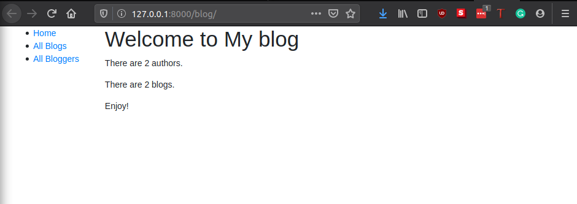
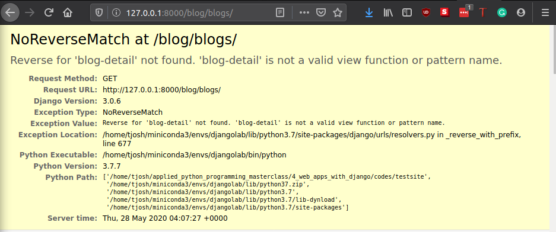

# Django Mini Blog, Part 2

Now that we have created a working but simplistic home page, we can now add more pages to achieve its purpose. We need;

- A view to show all blogs - Blogs List.
- A view to show all bloggers - Bloggers List.
- A view to show each blog's detail - Blog Details.
- A view to show each blogger's detail - Blogger Details.

We can do this by using **Django's generic class-based views** which will also help to reduce the amount of code we have to write for common use cases. We'll also go into URL handling in greater detail, showing how to perform basic pattern matching.
We are using a generic view because it already implements most of the functionality we need and follows Django best-practice, we will be able to create a more robust list view with less code, less repetition and ultimately less maintenance.

> Check out [Built-in class-based generic views](https://docs.djangoproject.com/en/2.1/topics/class-based-views/generic-display/) (Django docs) for many more examples of what you can do.

## Add List Views

Open `blog/views.py`, and add the following code into the file:

```python
from django.views import generic

# This view queries the database to get all the records 
# for the specified model (Blog) then render a template located at 
# /testsite/blog/templates/blog/blog_list.html
class BlogListView(generic.ListView):
    model = Blog

class AuthorListView(generic.ListView):
    model = Author

```

Now add the url paths in `blog/urls.py`. `views.BlogListView.as_view()` and `views.AuthorListView.as_view()` are the functions that will be called if a url matches.

```python
urlpatterns = [
    path("blogs/", views.BlogListView.as_view(), name="blogs"),
    path("bloggers/", views.AuthorListView.as_view(), name="bloggers"),
]
```

The view function has a different format than before — that's because this view was implemented as a class and we are inheriting from an existing generic view function that already does most of what we want this view function to do, rather than writing our own from scratch. For Django class-based views we access an appropriate view function by calling the class method `as_view()`. This does all the work of creating an instance of the class, and making sure that the right handler methods are called for incoming HTTP requests.

## Create a base generic template

In most cases, some parts of our website will present the same information so we do not need to create an all-new template every time we are creating a view. We can create a base template and let other templates `extend` this `base_generic.html` template. So let us create a base generic template and update our `index.html` to use this base template.

> Template `tags` are functions that you can use in a template to loop through lists, perform conditional operations based on the value of a variable, and so on. In addition to template tags, the template syntax allows you to reference variables that are passed into the template from the view, and use template filters to format variables (for example, to convert a string to lower case).

```html
<!DOCTYPE html>
<html lang="en">
<head>
  <title>Local Library</title>
</head>
<body>
  <!-- insert default navigation text for every page -->
  <!-- default content text (typically empty) -->
</body>
</html>
```

The code snippet below shows how to use the extends template tag and override the content block. The generated HTML will include the code and structure defined in the base template, including the default content you defined in the title block, but the new content block in place of the default one.

```html



  <h1>Local Library Home</h1>
  <p>Welcome to LocalLibrary, a website developed by <em>Mozilla Developer Network</em>!</p>

```

So now, let us use the above procedure to redesign our home page. First we create a `base_generic.html` template which will be extended by other templates.

```html
<!DOCTYPE html>
<html lang="en">

<head>
    
    <title>Tjosh Blog</title>
    
    <meta charset="utf-8">
    <meta name="viewport" content="width=device-width, initial-scale=1">
    <link rel="stylesheet" href="https://stackpath.bootstrapcdn.com/bootstrap/4.1.3/css/bootstrap.min.css"
        integrity="sha384-MCw98/SFnGE8fJT3GXwEOngsV7Zt27NXFoaoApmYm81iuXoPkFOJwJ8ERdknLPMO" crossorigin="anonymous">
    <!-- Add additional CSS in static file -->
    
    <link rel="stylesheet" href="">
</head>

<body>
    <div class="container-fluid">
        <div class="row">
            <div class="col-sm-2">
                
                <ul class="sidebar-nav">
                    <li><a href="">Home</a></li>
                    <li><a href="">All Blogs</a></li>
                    <li><a href="">All Bloggers</a></li>
                </ul>
                
            </div>
            <div class="col-sm-10">
                
                
            </div>
        </div>
    </div>
</body>

</html>
```

What we have done here is to basically add a `sidebar` to our website so that users can access other pages from clicking on the links in the sidebar. For example `<li><a href="">All Blogs</a></li>` creates a link `All Blogs` that leads to a page where all the blog posts on the website are shown. For now, all the links point to `index`. We will change that in later sections when we create the respective views.

We can now update our `index.html` template to extend the `base_generic.html` template.

```html


<title>Tjosh's Blog</title>


<h1>Welcome to My blog</h1>
<p>There are {{num_authors}} authors.</p>
<p>There are {{num_blogs}} blogs.</p>
<p>Enjoy!</p>

```

See how much less code we needed to write for that. You can test the site now and see the image below.



## Creating the List View template

Now let us create the templates for `All Blogs` and `All Bloggers` views. Just like the `index.html` template, we extend the `base_generic.html` template. Since we used an inbuilt django class based view, the expected template names are `blog_list.html` and `author_list.html` respectively. Also the expected path for class based view templates should be `blog/templates/blog/blog_list.html` and `blog/templates/blog/author_list.html`.

- For `All Blogs`, add the following in `blog/templates/blog/blog_list.html`:
  
```html



<h1>All Blogs</h1>

<ul>
    
    <li>
        <a href="{{ blog.get_absolute_url}}">{{blog.title}}</a>
        <p>{{blog.description}}</p>
    </li>
    

<p>There are no blog posts in this blog.</p>

</ul>

```

- For `All Bloggers`, add the following in `blog/templates/blog/author_list.html`:

```html



<h1>Author List</h1>

<ul>
    
    <li>
        <a href="{{ author.get_absolute_url }}">{{ author }} </a>
    </li>
    
</ul>

<p>There are no bloggers in this blog.</p>


```

In templates above, we have used some additional tags such as the `if` statement and the `for` loop. These are explained below. As you are already familiar with this kind of execution in python, this is the way to perform those operations in a html template.

## Conditional execution

We use the `if`, `else`, and `endif` template tags to check whether the `blog_list` has been defined and is not empty. If `blog_list` is empty, then the else clause displays text explaining that there are no blogs to list. If `blog_list` is not empty, then we iterate through the list of blogs.

```html

  <!-- code here to list the blogs -->

  <p>There are no blog posts in this blog.</p>

```

## For loops

The template uses the `for` and `endfor` template tags to loop through the blog list, as shown below. Each iteration populates the blog template variable with information for the current list item.

```html

  <li> <!-- code here get information from each blog item --> </li>

```

## Accessing Variables

The code inside the loop creates a list item for each blog that shows both the title (as a link to the yet-to-be-created detail view) and the author.

```html
<a href="{{ blog.get_absolute_url }}">{{ blog.title }}</a> ({{blog.author}})
```

We access the fields of the associated blog record using the "dot notation" (e.g. blog.title and blog.author), where the text following the blog item is the field name (as defined in the model).

We can also call functions in the model from within our template — in this case we call` Blog.get_absolute_url()` to get a URL you could use to display the associated detail record. This works provided the function does not have any arguments (there is no way to pass arguments!)

## Update the urls and base template

Open the base template (**/testsite/blog/templates/base_generic.html**) and add url links, as shown below. This will enable the link in all pages.

```html
<li><a href="">Home</a></li>
<li><a href="">All Blogs</a></li>
<li><a href="">All Bloggers</a></li>
```

Note the relationship between the `url` in the template and the name in the `urlpatterns`.

```python
urlpatterns = [
    path("blogs/", views.BlogListView.as_view(), name="blogs"),
    path("bloggers/", views.AuthorListView.as_view(), name="bloggers"),
]
```

That's right, they are the same.

This will not work just yet, because we have not created the detailed view for blogs and bloggers. If you click the `sidebar` links, you will see an error like this:



## Creating the Detail View template

Next, let us create detail views and templates. The procedure is about the same as in creating list views above.

- First, add the views in `blog/views.py`.
  
```python
class BlogDetailView(generic.DetailView):
    model = Blog

class AuthorDetailView(generic.DetailView):
    model = Author
```

- Map the urls in `blog/urls.py`, add the following lines.

```python
from django.urls import re_path
urlpatterns = [
    ...
    re_path(
        r"^blogs/(?P<pk>\d+)$",
        views.BlogDetailView.as_view(),
        name="blog-detail",
    ),
    re_path(
        r"^bloggers/(?P<pk>\d+)$",
        views.AuthorDetailView.as_view(),
        name="author-detail",
    ),
]
```

The `re_path()` function is a more refined filtering (compared to `path()`) for strings that have a certain number of characters. It makes use of [Regular expressions](https://docs.python.org/3/library/re.html), which are incredibly powerful pattern mapping tool. The expresion used above - `(?P<pk>\d+)$`, matches a string that has `blog/` at the start of the line (`^blog/`), then has one or more digits (`\d+`), and then ends (with no non-digit characters before the end of line marker).

It also captures all the digits **`(?P<pk>\d+)`** and passes them to the view in a parameter named `pk`. The captured values are always passed as a string. For example, this would match `blog/1234` , and send a variable `pk='1234'` to the view.

- Create the templates in `blog/templates/blog/blog_detail.html` and `blog/templates/blog/author_detail.html` respectively.
  - For `blog/templates/blog/blog_detail.html`.

  ```html
  

  
  <h1>{{ blog.title }}</h1>
  <h4>{{ blog.author }} | <em>{{ blog.post_date }}</em> </h4>
  <p>
      {{ blog.body }}
  </p>
  
  ```

  - For `blog/templates/blog/author_detail.html`.

  ```html
  

  
  <h1>{{ author.name }}</h1>
  <p>
      {{ author.bio }}
  </p>
  
  ```

At this stage, we have successfully created a working website with blogs and bloggers. Users can also see a list detail of blogs and bloggers.

In the next sections, we will restrict some part our website to only logged-in users and add extra packages to allow us to post rich contents on our blog details page.
