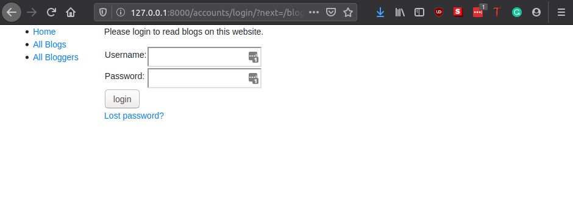

# Django Mini Blog, Part 3

## User Authentication and Permissions

On our website, we will want only logged-in users to view the detail of the blog and bloggers. Django provides an authentication and authorization ("permission") system, that allows you to verify user credentials and define what actions each user is allowed to perform.

### Enabling authentication

The authentication was enabled automatically when we first created the skeleton website, so you don't need to do anything more at this point.

You can find the configurations in teh `INSTALLED_APPS` and `MIDDLEWARE` sections of the project file (**`testsite/testsite/settings.py`**), as shown below.

```python
INSTALLED_APPS = [
    ...
    # Core authentication framework and its default models.
    'django.contrib.auth',
    # Django content type system (allows permissions to be associated with models).
    'django.contrib.contenttypes',
    ....

MIDDLEWARE = [
    ...
    # Manages sessions across requests
    'django.contrib.sessions.middleware.SessionMiddleware',
    ...
    # Associates users with requests using sessions.
    'django.contrib.auth.middleware.AuthenticationMiddleware',
    ....
```

We have already created some users for our website, all we need to do now is to set up the authentication views.

Add the following to the bottom of the project urls.py file `(testsite/testsite/urls.py)` file:

```python
#Add Django site authentication urls (for login, logout, password management)

urlpatterns += [
    path('accounts/', include('django.contrib.auth.urls')),
]
```

Navigate to the http://127.0.0.1:8000/accounts/ URL (note the trailing forward slash!) and Django will show an error that it could not find this URL, and listing all the URLs it tried. From this you can see the URLs that will work:

> Note: Using the above method adds the following URLs with names in square brackets, which can be used to reverse the URL mappings. You don't have to implement anything else — the above URL mapping automatically maps the below mentioned URLs.
>
>   accounts/ login/ [name='login']
    accounts/ logout/ [name='logout']
    accounts/ password_change/ [name='password_change']
    accounts/ password_change/done/ [name='password_change_done']
    accounts/ password_reset/ [name='password_reset']
    accounts/ password_reset/done/ [name='password_reset_done']
    accounts/ reset/<*uidb64*>/<*token*>/ [name='password_reset_confirm']
    accounts/ reset/done/ [name='password_reset_complete']

Now we need to create a registration directory on the search path and then add the template files. Note that the authentication templates are expected to be in `testsite/templates/`. To make these directories visible to the template loader, we need to update the project settings (**`testsite/testsite/settings.py`**) as follows.

```python
TEMPLATES = [
    {
        ...
        'DIRS': [os.path.join(BASE_DIR, 'templates')],
        'APP_DIRS': True,
        ...
    }
]
```

### Login template

Create a new HTML file called `testsite/templates/registration/login.html` and give it the following contents:

```html





<p>Your username and password didn't match. Please try again.</p>




<p>Your account doesn't have access to this page. To proceed,
    please login with an account that has access.</p>

<p>Please login to read blogs on this website.</p>



<form method="post" action="">
    
    <table>

        <tr>
            <td>{{ form.username.label_tag }}</td>
            <td>{{ form.username }}</td>
        </tr>

        <tr>
            <td>{{ form.password.label_tag }}</td>
            <td>{{ form.password }}</td>
        </tr>
    </table>

    <input type="submit" value="login" />
    <input type="hidden" name="next" value="{{ next }}" />
</form>

{# Assumes you setup the password_reset view in your URLconf #}
<p><a href="">Lost password?</a></p>


```

### Logout template

Create and open `/testsite/templates/registration/logged_out.html`. Copy in the text below:

```html



  <p>Logged out!</p>  
  <a href="">Click here to login again.</a>

```

## Restrict views based on permission

If you're using function-based views, the easiest way to restrict access to your functions is to apply the `login_required` decorator to your view function, as shown below. If the user is logged in then your view code will execute as normal. If the user is not logged in, this will redirect to the login URL defined in the project settings (settings.LOGIN_URL), passing the current absolute path as the next URL parameter. If the user succeeds in logging in then they will be returned back to this page, but this time authenticated.

```python
from django.contrib.auth.decorators import login_required

@login_required
def my_view(request):
    ...
```

> **Python Decorator**: A decorator in Python is any callable Python object that is used to modify a function or a class. A reference to a function "func" or a class "C" is passed to a decorator and the decorator returns a modified function or class. The modified functions or classes usually contain calls to the original function "func" or class "C". In this case, the `login_required` decorator modifies our function to restrict un-authenticated users from accessing the view.

Similarly, the easiest way to restrict access to logged-in users in your class-based views is to derive from [`LoginRequiredMixin`](https://docs.djangoproject.com/en/2.1/topics/auth/default/#the-loginrequired-mixin). You need to declare this mixin first in the superclass list, before the main view class.

```python
from django.contrib.auth.mixins import LoginRequiredMixin

class MyView(LoginRequiredMixin, View):
    ...
```

This has exactly the same redirect behaviour as the login_required decorator. You can also specify an alternative location to redirect the user to if they are not authenticated (login_url), and a URL parameter name instead of "next" to insert the current absolute path (redirect_field_name).

```python
class MyView(LoginRequiredMixin, View):
    login_url = '/login/'
    redirect_field_name = 'redirect_to'
```

Now update the `views.py`, as follows:

```python
from django.contrib.auth.mixins import LoginRequiredMixin # for class based views

...

class BlogDetailView(LoginRequiredMixin, generic.DetailView):
    model = Blog

class AuthorDetailView(LoginRequiredMixin, generic.DetailView):
    model = Author
```

Now if you try to see a blog detail you should get the output below:



You can login with your `useruser` details. Now you will be able to view the page.

## Update sidebar to include authentications.

Just to indicate that a user is logged in we can add the following in the `base_generic.html` template:

```html
    ...
    <li><a href="">All Bloggers</a></li>
    <hr>
    
    <li>User: {{user.get_username}}</li>
    <li><a href="?next={{request.path}}">Logout</a></li>
    
    <li><a href="?next={{request.path}}">Login</a></li>
    
    <hr>
```


## Bibliography

1. MDN Web Docs, User authentication and permissions - https://developer.mozilla.org/en-US/docs/Learn/Server-side/Django/Authentication
2. Python Course, Python Decorator - https://www.python-course.eu/python3_decorators.php