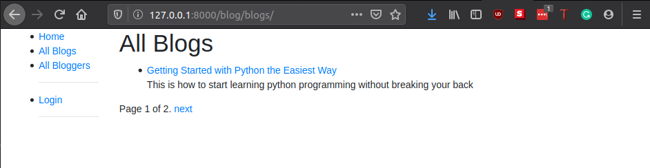
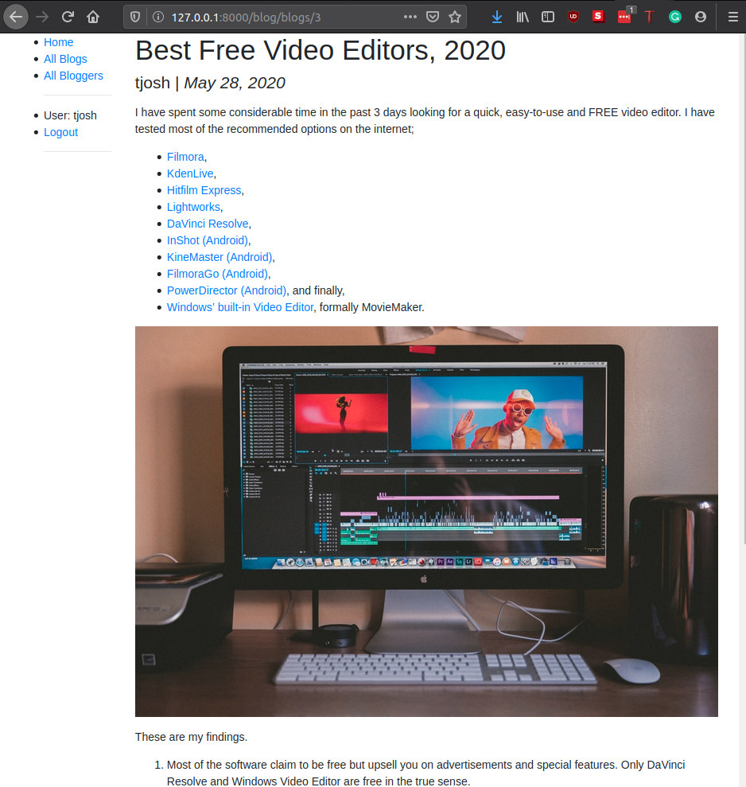

# More upgrades for our website

## Pagination

If and when we add a lot of blogs to our website, it will be necessary to divide blog lists into pages. For example, we might want only 10 blogs to show per page, so we need to paginate the contents. To do this, Open `blog/views.py`, and add the `paginate_by` line shown.

```python
class BlogListView(generic.ListView):
    model = Blog
    # set the maximum number of items on a page.
    paginate_by = 10
```

With this addition, as soon as you have more than 10 records the view will start paginating the data it sends to the template. The different pages are accessed using GET parameters — to access page 2 you would use the URL `/blogs/books/?page=2`.

Now that the data is paginated, we need to add support to the template to scroll through the results set. Because we might want to do this in all list views, we'll do this in a way that can be added to the base template.

```html

  
  
    
        <div class="pagination">
            <span class="page-links">
                
                    <a href="{{ request.path }}?page={{ page_obj.previous_page_number }}">previous</a>
                
                <span class="page-current">
                    Page {{ page_obj.number }} of {{ page_obj.paginator.num_pages }}.
                </span>
                
                    <a href="{{ request.path }}?page={{ page_obj.next_page_number }}">next</a>
                
            </span>
        </div>
    
   
```

The page_obj is a Paginator object that will exist if pagination is being used on the current page. It allows you to get all the information about the current page, previous pages, how many pages there are, etc. 

We use {{ request.path }} to get the current page URL for creating the pagination links. This is useful because it is independent of the object that we're paginating.

In my example, I have specified `paginate_by=1` so I can see the result.



## Rich Contents with ckEditor

Our website looks good so far. However, there is still one thing to address. The `models.TextField()` that we used to represent our blog body does not support rich contents such as images, hyperlinks, etc. We absolutely need this to have a fully working blog so we will employ an external package known as [`ckeditor`](https://ckeditor.com/) built on top of the django framework.

### Install ckeditor

This can be installed easily with `pip install django-ckeditor`. We can then import its `RichTextField` into the `testsite/blog/models.py`.

```python
from ckeditor.fields import RichTextField

class Blog(models.Model):
    """Model representing the blog posts or comments"""

    title = models.CharField(max_length=200)
    author = models.ForeignKey(User, on_delete=models.CASCADE)
    description = models.CharField(max_length=1500)
    post_date = models.DateField(null=True, blank=True)
    body = RichTextField() # update form normal modeld.TextField()

    def get_absolute_url(self):
        """Returns the url to access a blog"""
        return reverse("blog-detail", args=[str(self.id)])

    def __str__(self):
        return f"{self.title}"
```

Add it in `INSTALLED_APPS` in `testsite/settings.py`.

```python
INSTALLED_APPS = [
    ...
    'ckeditor',
    'blog',
]
```

Enable template to show rich contents by adding the `safe` tag to allow rendering of html objects directly on the site.

```html
<p>
    {{ blog.body | safe }}
</p>
```

Make migrations, to finalize the installation and run the website.

```bash
python manage.py makemigrations
python manage.py migrate
python manage.py runserver
```

### Add some rich contents

To demonstrate our new addition, we will copy a web page and add it as post in our blog page. You can copy from this page - https://toluwajosh.github.io/2020/01/04/best-free-video-editor-2020.html.

Now, log in to the [admin](http://127.0.0.1:8000/admin/) and add the copied content as a new blog post.

Finally, go back and view the page in the blog site. You should get something like this.




## Assignment (Challenge)

Add the functionality to post comments on each blog post. Take the following steps.

- Add `BlogComment` model, with `author`, `description`, `post_date` and `blog` fields.
- Add comment form in the template
  
- Add the following as the view. It reads input from the comment form in the template and adds a blog data into the database.

```python
def blog_comment_create(request):
    if request.method == "POST":

        form = AddCommentForm(request.POST)

        if form.is_valid():
            # description = form.cleaned_data["description"]

            description = form.data.get("description")
            if description == "":
                return HttpResponseRedirect(request.META["HTTP_REFERER"])
            blogtitle = form.data.get("blogtitle")
            blog_comment = BlogComment(description=description)
            blog_comment.post_date = datetime.datetime.now()

            blog_comment.author = request.user
            blog_comment.blog = Blog.objects.get(title=blogtitle)  # OR
            # blog_comment.blog = get_object_or_404(Blog, title=request.GET.get('title'))
            blog_comment.save()
            return HttpResponseRedirect(request.META["HTTP_REFERER"])

    else:
        return HttpResponseRedirect(reverse("index"))
```

- Add the following in `testsite/blog/forms.py`

```python
import datetime

from django import forms


class AddCommentForm(forms.Form):
    description = forms.Textarea()
    blogtitle = forms.CharField()
```

- Update `testsite/blog/templates/blog/blog_detail.html` template to include the comment form.

```html
</p>
<h4>Add a comment</h4>
<form action="" method="post">
    
    <textarea name="description" rows="1" cols="40"></textarea>
    <input type="hidden" name="blogtitle" value="{{ blog.title }}">
    <input type="submit" value="Submit">
</form>
<h3>Comments</h3>

<p><em>{{comment.author}}</em> | {{comment}}</p>

</p>
```

- Finally, add a path the points to `blogcomment_create`.

This might look like a mouthful but all you need is to put the pieces together. If you are able to achieve this, then your understanding of this subject can be said to be advanced.